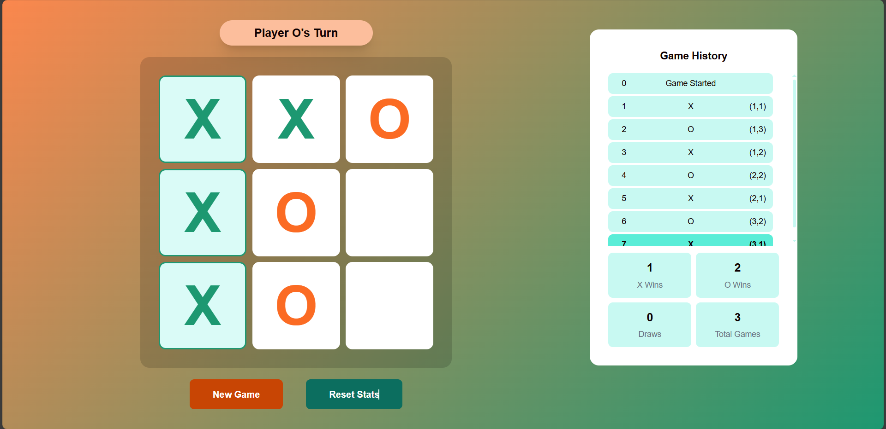
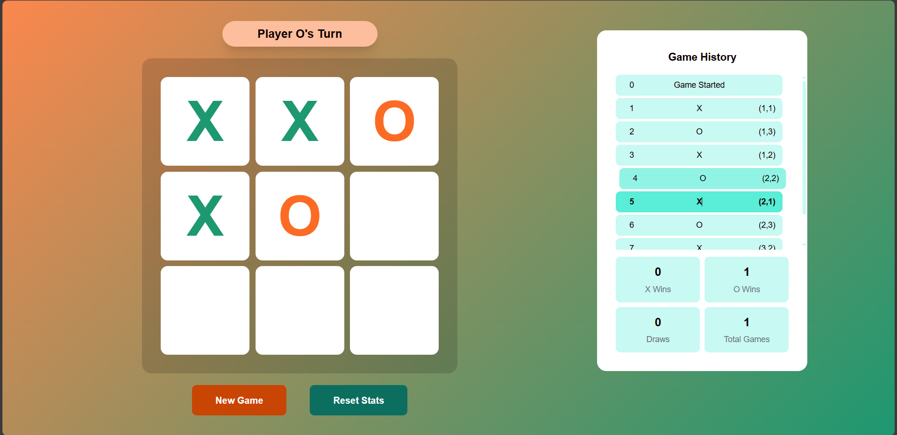
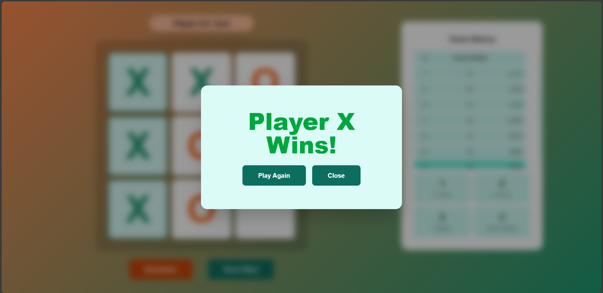
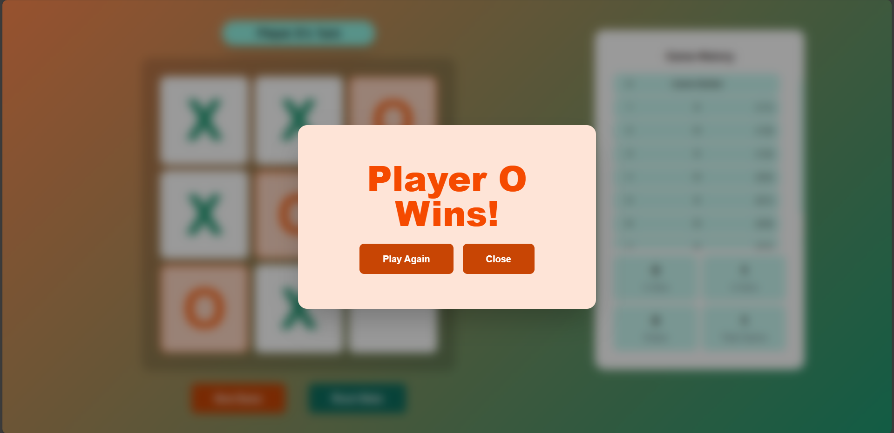

# Tic-Tac-Toe Game

A modern Next.js implementation of the classic Tic-Tac-Toe game with advanced features like game history tracking, statistics, and responsive design.






## Features
- 🎮 Classic 3x3 Tic-Tac-Toe gameplay
- ⏳ Full game history with time travel functionality
- 📊 Real-time game statistics and win/loss ratios
- 🏆 Victory detection and result modal animations
- 📱 Responsive design for all screen sizes
- 💾 Local storage for persistent game state
- 🔄 Context API for state management

## Installation
1. Clone the repository:
```bash
git clone https://github.com/devcedrick/tic-tac-toe.git
```
2. Install dependencies:
```bash
npm install
```
3. Start the application:

**For development (with hot reloading):**
```bash
npm run dev
```

**For production (requires build first):**
```bash
npm run build
npm start
```

## Usage
- Click squares to make moves
- Click any move in history to time travel
- View real-time stats in the sidebar
- Game automatically saves progress between sessions

## Project Structure
```
/
├── app/            # Next.js page routes and layouts
├── components/     # React components
│   ├── layout/     # Game layout components
│   └── ui/         # UI components and cards
├── contexts/       # React context providers
├── hooks/          # Custom React hooks
├── lib/            # Utility functions
├── public/         # Static assets
├── types/          # TypeScript type definitions
└── README.md
```

Built with:
- Next.js 14
- TypeScript
- Tailwind CSS